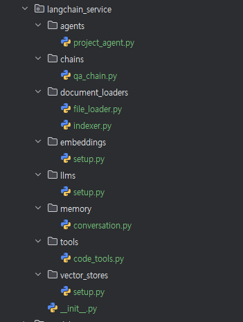
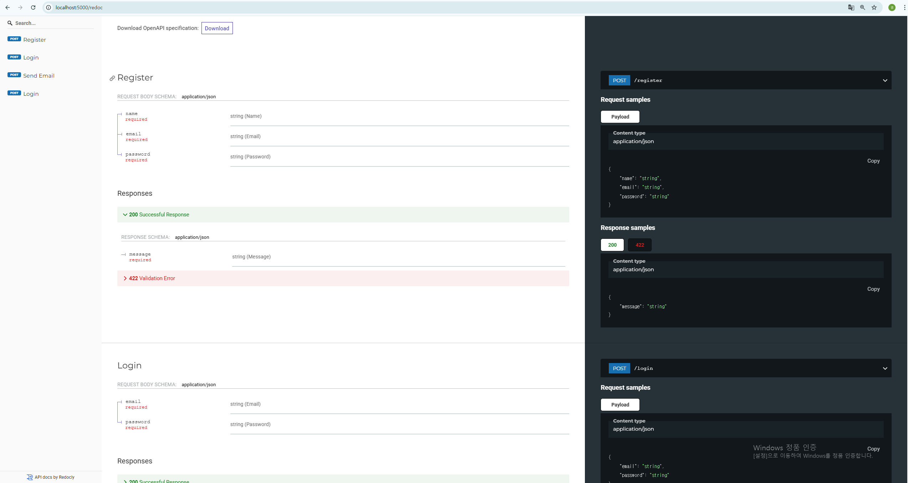
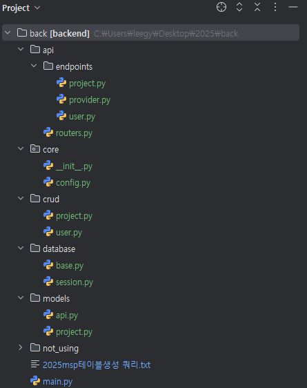

## 세팅 
### config.py 
CORE 모듈의 config.py에서 모든 API KEY, DB 접속 정보, 이메일 인증 정보 등을 설정합니다.
```
DB = 'postgresql'
DB_USER = 'postgres'
DB_PASSWORD = '1234'
DB_SERVER = 'localhost'
DB_PORT = '5432'
DB_NAME = 'msp_database'

SMTP_SERVER = 'smtp.gmail.com'
SMTP_PORT = 587
SENDER_EMAIL = 'MY ADDRESS'
SENDER_PASSWORD = 'MY KEY'

CLAUDE_API = "ANTHROPIC KEY"
GPT_API = "OPEN AI KEY"
```

### 패키지 설치
```
pip install -r requirements.txt
```

## DB 마이그레이션
### Alembic 설치 확인
```
alembic --version
```
해당 명령어로 설치 확인 후, 설치가 제대로 안 되었을 시에는
```
pip install alembic
```
수동 설치

### 마이그레이션 파일 생성
```
alembic revision --autogenerate -m "2025-03-19"
```

### Alembic 적용
```
alembic upgrade head
```
### PG VECTOR 관련 에러 해결 방법 ( 예시 )
Alembic이 생성한 versions 폴더의 가장 최신 코드에 Vector 관련 설정을 적용합니다.
```
from pgvector.sqlalchemy import Vector # PG VECTOR를 임포트합니다.

def upgrade() -> None:
    # ### commands auto generated by Alembic - please adjust! ###
    op.alter_column('project_info_base', 'vector_memory',
               existing_type=postgresql.ARRAY(sa.INTEGER()), 
               type_=Vector(dim=1536), # 타입을 VECTOR(dim=1536)으로 변경합니다.
               existing_nullable=True)
    # ### end Alembic commands ###


def downgrade() -> None:
    # ### commands auto generated by Alembic - please adjust! ###
    op.alter_column('project_info_base', 'vector_memory',
               existing_type=Vector(dim=1536), # #타입을 Vector(dim=1536)으로 변경합니다.
               type_=postgresql.ARRAY(sa.INTEGER()),
               existing_nullable=True)
```
### alembic upgrade head 실행 시 오류
```
INFO  [alembic.runtime.migration] Context impl PostgresqlImpl.
INFO  [alembic.runtime.migration] Will assume transactional DDL.
INFO  [alembic.runtime.migration] Running upgrade  -> 03930cf2be1a, 2025-03-19
Traceback (most recent call last):
  File "/home/bctone/meta-llm-msp/backend/venv/lib/python3.10/site-packages/sqlalchemy/engine/base.py", line 1964, in _exec_single_context
    self.dialect.do_execute(
  File "/home/bctone/meta-llm-msp/backend/venv/lib/python3.10/site-packages/sqlalchemy/engine/default.py", line 942, in do_execute
    cursor.execute(statement, parameters)
psycopg2.errors.DuplicateTable: relation "provider_table" already exists
...
sqlalchemy.exc.ProgrammingError: (psycopg2.errors.DuplicateTable) relation "provider_table" already exists

[SQL:
CREATE TABLE provider_table (
        id SERIAL NOT NULL,
        name VARCHAR(255) NOT NULL,
        status VARCHAR(50),
        website VARCHAR(255),
        description TEXT,
        PRIMARY KEY (id),
        UNIQUE (name)
)

]
```
## 실행 방법 
main.py를 
Pycharm 환경에서 작업 시 녹색 화살표 버튼을 클릭하면 실행됩니다.
### main.py
```
from fastapi import FastAPI
from api.routers import router
from fastapi.middleware.cors import CORSMiddleware

app = FastAPI()
app.add_middleware(
    CORSMiddleware,
    allow_origins=["*"],  # 모든 도메인에서 접근 허용, 실제 운영 환경에서는 특정 도메인만 허용하는 것이 좋음
    allow_credentials=True,
    allow_methods=["*"],  # 모든 HTTP 메서드 허용
    allow_headers=["*"],  # 모든 헤더 허용
)

app.include_router(router)

if __name__ == "__main__":
    import uvicorn
    uvicorn.run(app, host="0.0.0.0", port=5000)
```

## 2025-03-13 작업 내용
FastAPI 구조에 맞게 전체 디렉터리 및 코드 구조를 변경 중입니다.
또한 CORE와 DATABASE 디렉터리에서 중요한 정보와 DB 관련 함수들을 정의해서,
실제 엔드 포인트 코드들을 최대한 간소화하는 작업 중에 있습니다.

현재 USER 관련 기능은 성공적으로 실행되며,
프로젝트랑 LLM은 아직 새로운 구조로 변경하는 작업 중에 있습니다.

아직 새로운 코드 구조로 변경하지 못한 코드들은 not_using 디렉터리에 전부 주석 처리 후 보관 중입니다.


## 2025-03-14 변경 사항
주요 변경 사항은 되도록 https://supermind.bctone.kr/c/ai-dev/ 에 작성 후 링크를 남기겠습니다.
### Alembic 기반 Migration 설정
https://supermind.bctone.kr/c/ai-dev/msp-backend-migration
해당 작업 진행 중 base.py, session.py, models 모듈의 init.py에도 약간의 변경 사항이 생겼습니다.
### Pydantic 스키마 구현
https://supermind.bctone.kr/c/ai-dev/msp-1f17f9
## 2025-03-17 변경 사항
https://supermind.bctone.kr/c/ai-dev/msp-crud
CRUD 디렉터리를 생성하여, 엔드포인트 정의 시 사용할 함수들을 미리 정의했습니다.
또한 기존 디렉터리 구조에 LangChain 디렉터리가 추가되었습니다.



아직 프로젝트 엔드포인트 코드가 제대로 작성되지 않았기 때문에 LangChain 작업은 이 작업이 끝난 뒤에 바로 시작할 예정입니다.
기존 provider.py로 정리하려던 구조는 전부 langchain.py로 대체될 것 같습니다.

이제 localhost:5000/redoc 에서 USER 관련된 모든 엔드포인트 테스트 가능합니다.

## 2025-03-18 변경 사항
https://supermind.bctone.kr/c/ai-dev/langchain
현재 생성된 LangChain 구조 분석 후 일부 코드 수정 중입니다.
각 기능이 제대로 정상 작동하는지 확인하기 위해 각 코드에 test 코드 진행 중입니다.
현재 QA_CHAIN과 대화 메모리 저장, 2가지 기능만 마지막으로 테스트하면 LangChain 세팅 마무리되어서 LangChain 관련 기능 작업 시작 가능할 것 같습니다.

## 2025-03-19 변경 사항


DB 구조 수정됐습니다.

## 2025-03-20 변경 사항
파일 업로드 기능 추가
DB 일부 변경
프로젝트 생성 / 프로젝트 리스트 로직 새 DB 구조 기준으로 재작성

## 2025-03-27 변경 사항
Admin 페이지 관련 엔드포인트 작성 완료

## 2025-03-31 변경 사항


# 2025년 4월 1주차 Todo LIst 

## 문서 작업
- [ ] LangChain 포함된 프로젝트 구조 이미지 / 표 추가
- [ ] LangChain 관련된 기능과 아닌 기능 정리
- [ ] 기존 방식과 LangChain 사용했을 때의 차이점 정리

## 파일 관리
- [ ✅ ] 파일 청크 단위로 나눠서 관리
- [ ] 지식 베이스도 이전 대화 목록과 같이 LLM에 전달
- [ ] 지식베이스 VS 대화 기록 관련해서 순서 혼동되지 않게 정리하는 로직 구현

## 대화 기능
- [ ✅ ] LangChain 벡터 검색 기반 대화 방식 적용 후 테스트
- [ ] 테스트 이후 성능 좋으면 기존 방식을 해당 방식으로 교체
- [ ✅ ] 대화 시작하면 첫 문장 바탕으로 LLM이 자동으로 세션 제목 생성
- [ ✅ ] 최근 대화만 반영하는 방식 테스트 
- [ ✅ ] 모델 선택 기능
## 기타
- [ ✅ ] 프론트 엔드 변경 사항에 맞게 백엔드 코드 수정